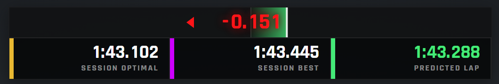
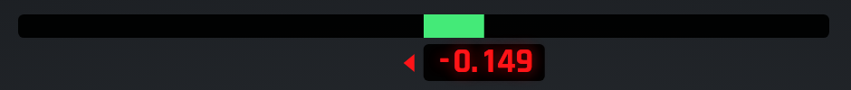

<div align="center">

# ACE Better Delta Bar

**A delta bar for Assetto Corsa EVO that shows whether you are gaining or losing time right now, not only whether the lap is up or down.**<br>

[](../../releases/latest)
[](https://github.com/dreasgrech/ACEUIAppLoader)

</div>

<p align="center"></p>

The stock delta bar colours its bar **and** its number by the same thing: green while your
lap as a whole is ahead of the reference, red while it is behind. So a lap that is four
tenths up but bleeding time through every corner is green all the way round, and you only
find out by watching the digits move.

This one keeps the bar for the overall delta and colours the **number by the trend**:

- **green** while you are gaining on the reference right now,
- **red** while you are losing to it,
- **white** while nothing is changing,

with a chevron pointing the way the end of the bar is moving, brighter when it is moving fast. One glance
tells you both things: the bar says where the lap stands, the number says which way it is
heading.

Under the bar, a row of lap times: **session optimal**, **session best** and the
**predicted lap** coloured against your best (the last lap too, if you want it). Or switch to
the **compact** layout, a thin bar with the number in a tag that rides the end of the fill,
the iRacing shape:

<p align="center"></p>

Either layout can add a **lap trace** that draws the delta across the lap as you drive it,
so the corner that cost the time is still on the screen at the end of the straight. Drag
the widget anywhere on the HUD and it stays there.

---

## Installing the ACEBetterDeltaBar app

> [!WARNING]
> This is an app for the [ACE UI App Loader](https://github.com/dreasgrech/ACEUIAppLoader) mod so that needs to be installed (a single file) as well.

<table>
<tr><td width="40" align="center"><h3>1</h3></td><td>

Download the **`ACEBetterDeltaBar-….zip`** from the [latest release](../../releases/latest) and open it.
Inside are two folders, `mods` and `Video`.

</td></tr>
<tr><td align="center"><h3>2</h3></td><td>

Press <kbd>Win</kbd> + <kbd>R</kbd>, paste this in, press <kbd>Enter</kbd>:

```
%USERPROFILE%\Saved Games\ACE
```

</td></tr>
<tr><td align="center"><h3>3</h3></td><td>

Drag **both** folders out of the zip into that window. If Windows asks, choose to **merge**.
Nothing to run.

</td></tr>
</table>

In the car, move your mouse to the right edge of the screen. The delta bar is listed in the
app drawer with its own switch and an **OPTIONS** button.

> [!TIP]
> You will probably want to switch the game's own delta bar off, or you have two. In the game:
> **Settings → Gameplay → HUD → Delta Widget → Off**. Nothing about this app depends on it.

---

## Reading it

| | |
|---|---|
| **The bar** | The overall delta for the lap: it grows out from the centre, **right and green** when the lap is ahead of the reference, **left and red** when it is behind, the same way round as the game's own bar (*Faster side* turns it round). A bright tick marks the end of the fill. A tenth of a second is a tenth of the way to the edge by default (see *Bar range*). |
| **The number** | The same delta as a figure, `-0.235` for time gained, `+0.235` for time lost. Its **colour is the trend**: is the number going down (green, you are gaining) or up (red, you are losing) over the last second? White means it is holding. |
| **The chevrons** | Point the way the end of the fill is moving: towards the faster side (right, by default) while you are gaining, towards the slower side while you are losing. They brighten when the trend is strong. |
| **SESSION OPTIMAL** | Your best sectors of the session added up, with a gold tab. |
| **SESSION BEST** | Your best lap of the session, with a purple tab. |
| **PREDICTED LAP** | The lap time this pace ends in, green when it beats your best, red when it does not. |
| **LAST LAP** | Your last lap, off by default. |
| **The lap trace** | Off by default. A strip that fills as you go round: above the line where you were gaining at that point of the lap, below where you were losing, in the same colours. It clears when you cross the line. |
| **INVALID** | Appears when the game has invalidated the lap. |
| **vs Name** | Appears when the delta is against another driver rather than your own lap. |

With no reference lap yet the number is a dim placeholder and the top line says so. The
reference is whatever the game itself is using for its delta, so it changes exactly when
the stock one does.

---

## Options

**OPTIONS** in the app drawer opens the settings. Everything you change is kept, through
the HUD reload and a restart. Click a section header to fold it. Defaults in bold.

**Layout**
- *Layout*: **full** (the figure on the bar, the lap times under it) or compact (a thin
  bar with the figure in a tag under it).
- *Panel scale*: 0.6 to 2.0 in steps of 0.1, default **1.0**.
- *Width*: narrow, **normal** or wide.
- *Faster side*: which way the bar grows for time gained: **right**, as the game's own bar
  does, or left, as iRacing's does.
- *Bar range*: the delta that fills the bar (and the trace): 0.5 s, **1 s**, 2 s or 5 s.
- *Decimals*: 2 or **3**.
- *Figure follows the fill*: **on**. In the compact layout the tag moves with the end of the
  bar; off keeps it centred.

**Colour**
- *Number colour*: **trend** (green while gaining, red while losing, white while steady),
  overall (the stock rule: green while the lap is up, red while it is down) or white.
- *Bar colour*: **overall** (its side's colour) or trend.
- *Trend window*: how far back the trend looks: 0.5 s, **1 s** or 2 s.
- *Trend sensitivity*: fine, **normal** or coarse. Fine reacts to less; coarse waits for
  more before it changes colour.

**Show**
- *Trend chevrons*, *session optimal*, *session best*, *predicted lap*, *invalid lap tag*,
  *driver name*: each **on**. *Lap trace* and *last lap*: **off**. The compact layout shows
  none of the lap times or the trace.

**Look**
- *Background*: **dark**, light or none.

**Demo**
- *Attract mode*, **off**: a scripted lap, for recording without driving.

**Reset to defaults** puts every value back.

---

## If something isn't right

<details>
<summary><b>It isn't in the app drawer</b></summary><br>

1. **The loader isn't installed**, or its drawer doesn't appear at all. Start with the
   [loader's own help](https://github.com/dreasgrech/ACEUIAppLoader#if-something-isnt-right).
2. **Only one of the two folders was copied.** The app needs both: the folder under `mods`
   and the small file under `Video`. That file must stay completely empty.

</details>

<details>
<summary><b>It says "no reference lap"</b></summary><br>

The game has no lap to compare against yet: drive a full lap first. The reference is the
game's own, so this app shows a delta exactly when the stock delta bar would.

</details>

<details>
<summary><b>The lap trace stays empty</b></summary><br>

The trace needs the car's position along the lap, which the game reports in most modes.
If it never fills, switch *Lap trace* off in the options and open an
[issue](../../issues) saying which mode and track you were in.

</details>

<details>
<summary><b>Anything else</b></summary><br>

Open an [issue](../../issues) and say what you saw. If you can, attach the newest file from
`%USERPROFILE%\Saved Games\ACE\Logs`.

</details>

---

## Uninstalling

Delete the folder `mods\uiresources\ACEUIAppLoader\betterdeltabar` and the file
`Video\ACEUIAppLoader-betterdeltabar.settingspreset`, both under `Saved Games\ACE`. Your
settings stay in the game's UI settings file, where the game ignores them.

---

<div align="center">
<sub>Better Delta Bar 0.1.0 · needs ACE UI App Loader 0.23.0 or newer</sub>
</div>
